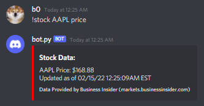
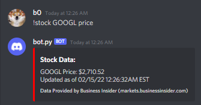
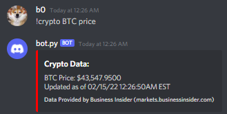
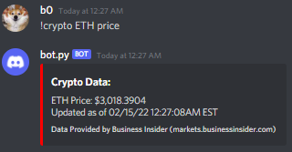

# Stock/Crypto Web Scraping Bot

**Version 1.0**

A Discord bot created with Python to web scrape various user requested crypto and stock information given the ticker symbol. Price data provided by Business Insider (markets.businessinsider.com).

Gathering Stock Data: 
---------------------
```
!stock AAPL price
```
This command will fetch the stock with ticker AAPL at the time requested.


```
!stock GOOGL price
```
This command will fetch the stock with ticker GOOGL at the time requested.


Gathering Crypto Data: 
---------------------
```
!crypto BTC price
```
This command will fetch the crypto with ticker BTCUSD at the time requested.


```
!crypto ETH price
```
This command will fetch the crypto with ticker ETHUSD at the time requested.

